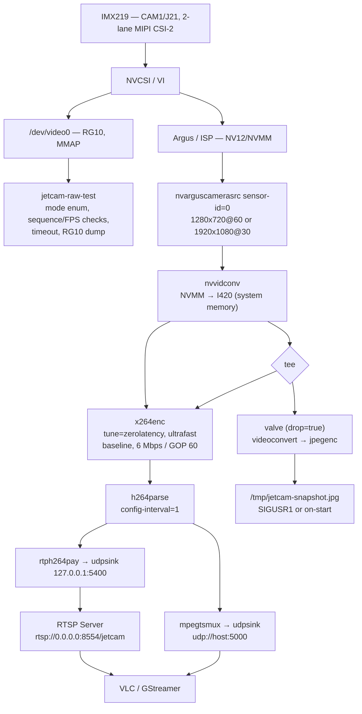

# JetCam Stack

CSI camera pipeline for NVIDIA Jetson Orin Nano + Sony IMX219. Direct V4L2 validation, driver tweaks, and a GStreamer service that streams H.264 over UDP or RTSP. Built for the Orin Nano's reality: no NVENC, so it uses software x264.

## Architecture



Two paths share the sensor and NVCSI/VI. `jetcam-raw-test` bypasses the ISP to validate the driver. `jetcamd` goes through Argus/ISP for viewable video.

## Validated Platform

| Component | Value |
|---|---|
| Board | Jetson Orin Nano DevKit Super (P3767-0005 + P3768) |
| Camera | Sony IMX219, CAM1/J21, CSI-C, 2 lanes |
| JetPack | 6.2.3 / L4T R36.5.0, kernel 5.15.185-tegra |
| Stack | V4L2 + Media Controller + Argus/ISP + NVMM |
| Video | GStreamer 1.20.3, x264 software H.264 |

Orin Nano has no NVENC — `nvv4l2h264enc` is intentionally not used.

## Repo Layout

```
app/jetcam-raw-test   V4L2 MMAP capture, mode enum, stats, RG10 export
app/jetcamd           GStreamer service — UDP, RTSP, snapshots
config/jetcamd.conf   Runtime config (key=value)
driver/patches        R36.5 IMX219 test-pattern + overlay patches
scripts/              collect-baseline, stage 2/3/4 checks
baseline/             Sanitized logs + SHA256SUMS from target
docs/                 Hardware, camera-stack, usage guides
```

## Quick Start

On the Jetson:

```bash
sudo apt-get update && sudo apt-get install -y \
  cmake g++ pkg-config v4l-utils \
  libgstreamer1.0-dev libgstreamer-plugins-base1.0-dev \
  gstreamer1.0-plugins-bad gstreamer1.0-plugins-ugly \
  libgstrtspserver-1.0-dev vlc

cmake -S . -B build -DCMAKE_BUILD_TYPE=Release
cmake --build build -j$(nproc)
ctest --test-dir build --output-on-failure
```

Raw capture — list modes then grab 120 frames:

```bash
./build/app/jetcam-raw-test/jetcam-raw-test --list
./build/app/jetcam-raw-test/jetcam-raw-test --sensor-mode 4 --width 1280 --height 720 --fps 60 --frames 120
# 10-min soak
./scripts/test-stage2.sh
```

Stream — UDP to localhost, watch with VLC:

```bash
./build/app/jetcamd/jetcamd --config config/jetcamd.conf
cvlc udp://@:5000
```

Stream to another machine:

```bash
./build/app/jetcamd/jetcamd --config config/jetcamd.conf --set host=192.168.1.50
# on receiver: udp://@:5000
```

RTSP:

```bash
./build/app/jetcamd/jetcamd --config config/jetcamd.conf --set output=rtsp
# client: rtsp://JETSON_IP:8554/jetcam
```

Snapshot (SIGUSR1 opens the valve for one JPEG):

```bash
kill -USR1 $(pgrep -n jetcamd)
# → /tmp/jetcam-snapshot.jpg
```

Print pipeline without opening the camera:

```bash
./build/app/jetcamd/jetcamd --config config/jetcamd.conf --print-pipeline
```

Config is `key=value` per line — `sensor_id`, `width`, `height`, `framerate`, `bitrate_kbps`, `gop`, `output` (udp/rtsp), `host`/`port`, `rtsp_port`/`rtsp_mount`, `snapshot_file`. Override with `--set KEY=VALUE` after `--config`.

## Hardware Baseline

Collect from a dev machine (no creds stored):

```bash
JETCAM_REMOTE=user@JETSON_IP ./scripts/collect-baseline.sh baseline/$(date +%Y-%m-%d)-jetson-orin-nano
```

Checked-in evidence (sanitized + checksummed):

- [Stage 1 baseline](baseline/2026-08-07-jetson-orin-nano/README.md) — v4l2, media topology, device tree
- [Stage 2 RAW 10-min](baseline/2026-08-07-stage2-jetson-orin-nano/README.md) — 36,076 frames, 60.1 FPS, zero drops
- [Stage 3 driver](baseline/2026-08-07-stage3-jetson-orin-nano/README.md) — test-pattern + overlay
- [Stage 4 stream](baseline/2026-08-07-stage4-jetson-orin-nano/README.md) — UDP/RTSP, VLC, snapshots, 30-min soak

## Driver Patches

In `driver/patches`, for R36.5 only:

- `0001-imx219-add-v4l2-test-pattern.patch` — adds `V4L2_CID_TEST_PATTERN` (GPL-2.0-only)
- `0002-imx219-c-stage3-overlay.patch` — marks validated IMX219-C overlay

Apply to the matching NVIDIA source; keep a bootable backup kernel. See `driver/patches/README.md`.

---
*Last updated: 2026-08-17*
